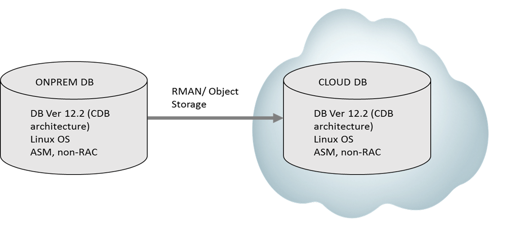

Updated: November 16, 2017

## Introduction

This is the first of several labs that are focused on helping traditional Oracle Database
Administrators who are looking to get hands on experience in doing their day to day Database
administrator tasks on Oracle Cloud Infrastructure. We will have several of these labs covering
deployment, migration, storage, backup and recovery, Disaster Recovery, High Availability,
Security and monitoring. In this Lab we will focus on how to migrate On-premises Oracle
Database to Oracle Database hosted on Oracle Cloud Infrastructure.

## Exercises

- Download and install Storage Cloud Module in On-premise database
- Run RMAN backup from on-premise to Oracle Storage Cloud
- Configure Storage Cloud Module on Cloud DB system to access the RMAN
- Build Database on Cloud using the RMAN backup
- Update the database with the latest cumulative backups.
- Register the new restored database.
- Establish TNS connection to Cloud Database

## Assumptions

- Oracle Cloud Infrastructure account/password.
- On-premise Oracle Database is version 12.2 , CDB with single PDB
- Oracle Database on Oracle Cloud Infrastructure is version 12.2, CDB with single PDB
- ASM is utilized as Volume manager in both on-premise and cloud
- Backup will be sent to Oracle Object Storage in OCI; Database restore will use the
    backups from Object Storage.
- Network connectivity between On-premise and Cloud is already established. If you
    would like to learn more about this connectivity details, please refer to the document
    https://docs.us-phoenix-
    1.oraclecloud.com/Content/Network/Concepts/connectivityonprem.htm
- Application can tolerate ‘downtime’ needed to refresh the database from the
    incremental backups.

## Architecture



There are two **SECTIONS** in this document.

**SECTION #1** – Steps to backup the on-premises database to **Oracle Object Storage** using **RMAN**.

**SECTION #2** – Restore the RMAN backupsets stored in Object Store in Oracle Cloud and build Oracle Database in **Oracle Cloud Infrastructure**. Update the database with the most current cumulative backups.

## SECTION #1

Backup the On-premise Oracle Database to **Oracle Object Storage** via **RMAN**.

### **STEP1**: Login in to OCI console and create a Bucket for keeping the backups in Object Store.
Click on **Storage** menu,and then **Object Storage**, press ‘Create Bucket’. I have created a Bucket called **‘ONPREM_BKUP’** for our test. To understand "Object Storage" resources, please refer to the
below link
 **https://docs.us-phoenix-1.oraclecloud.com/Content/Object/Concepts/overview.htm**

 

### **STEP 2**

In order to interface with the Oracle Object Storage from on-premise environment, Oracle
Cloud Infrastructure provides two types of RESTful APIs.

- The Native Bare Metal Cloud API, accessible from the end point
  **https://objectstorage.us-phoenix-1.oraclecloud.com**

- Openstack Swift compatible API, accessible from the end point
  **https://swiftobjectstorage.us-phoenix-1.oraclecloud.com**

The first one is for General Purpose, we will use Swift API (second URL) for backing up RMAN backups to Object Storage.

So, as next step, lets generate a Swift password from OCI console.

On the right-hand corner of the console, click on the login name **(first.last@company.com )**, choose ‘User Settings’ from the pull-down menu, on the left side menu, click on **Swift Password**,
Generate Password by providing Description.

 

We will likely to see a long string of password. Copy and save the password.

### **STEP 3**

SSH to On-Premise database server using putty as **opc** user. sudo to **oracle** and set the environment using .oraenv.

 
```
[oracle@onprem ~]$. oraenv
ORACLE_SID = [oracle]? ONPREM
The Oracle base has been set to /u01/app/oracle
[oracle@onprem ~]$
```

Next step is to download and install **Database Backup Cloud Module**. Use the below Link to
download and install Backup Cloud Module.

**https://docs.oracle.com/en/cloud/paas/db-backup-cloud/index.html**

Note the directory where opc_install.zip file is downloaded and extracted. In my environment it was under /opt/oracle/oak/pkgrepos/oss/odbcs

```
[oracle@onprem ~]$ cd /opt/oracle/oak/pkgrepos/oss/odbcs
[oracle@onprem odbcs]$ ls
libopc.so opc_install.jar
[oracle@onprem odbcs]$
```

### **STEP 4**

Now, let’s install the Backup Module. We need to create lib directory. Let’s create it under
/home/oracle.

```
mkdir /home/oracle/lib
```

The following command will install the Module.

```
[oracle@onprem]$ java -jar opc_install.jar -opcID 'xxxx.xxxxx@oracle.com' -opcPass
'zyEG3X#3LnFMzhnnc]zT' -container ONPREM_BKUP -walletDir ~/hsbtwallet/ -libDir ~/lib/ -configfile
~/config -host https://swiftobjectstorage.us-phoenix-1.oraclecloud.com/v1/<tenantid>
```


**'zyEG3X#3LnFMzhnnc]zT'** -  is the Swift password generated in step 2.

**opcID** - is your id you used to login. Usually first.last@company.com

**‘ONPREM_BKUP’** - is the Bucket we created earlier

**hsbwallet** is used for wallet keys for the backup. This is different from RMAN encryption key.

**Config** is the configuration file that the installer sets up during the install. The output of the command, should look like this.

### **STEP 5**

Next is to set up RMAN parameters. We will use ‘nocatalog’ for this.

The below command will configure RMAN to point to libraries installed.

```
RMAN> CONFIGURE CHANNEL DEVICE TYPE 'SBT_TAPE' PARMS
'SBT_LIBRARY=/home/oracle/lib/libopc.so, SBT_PARMS=(OPC_PFILE=/home/oracle/config)';

using target database control file instead of recovery catalog

old RMAN configuration parameters:
CONFIGURE CHANNEL DEVICE TYPE 'SBT_TAPE' PARMS
'SBT_LIBRARY=/home/oracle/lib/libopc.so, SBT_PARMS=(OPC_PFILE=/home/oracle/config)';
new RMAN configuration parameters:
CONFIGURE CHANNEL DEVICE TYPE 'SBT_TAPE' PARMS
'SBT_LIBRARY=/home/oracle/lib/libopc.so, SBT_PARMS=(OPC_PFILE=/home/oracle/config)';
new RMAN configuration parameters are successfully stored

RMAN>

Make the default DEVICE to SBT_TAPE instead of DISK.

RMAN> CONFIGURE DEFAULT DEVICE TYPE TO SBT_TAPE;

new RMAN configuration parameters:
CONFIGURE DEFAULT DEVICE TYPE TO 'SBT_TAPE';
new RMAN configuration parameters are successfully stored

Below command will skip backups of the files that haven’t changed since backup.

RMAN> CONFIGURE BACKUP OPTIMIZATION ON;
new RMAN configuration parameters:
CONFIGURE BACKUP OPTIMIZATION ON;
new RMAN configuration parameters are successfully stored

To backup controlfile automatically

RMAN> CONFIGURE CONTROLFILE AUTOBACKUP ON;
new RMAN configuration parameters:
CONFIGURE CONTROLFILE AUTOBACKUP ON;
new RMAN configuration parameters are successfully stored

RMAN> CONFIGURE CONTROLFILE AUTOBACKUP FORMAT FOR DEVICE TYPE SBT_TAPE TO '%F';
new RMAN configuration parameters:
CONFIGURE CONTROLFILE AUTOBACKUP FORMAT FOR DEVICE TYPE 'SBT_TAPE' TO '%F';
new RMAN configuration parameters are successfully stored

Set encryption on

RMAN> CONFIGURE ENCRYPTION FOR DATABASE ON;


new RMAN configuration parameters:
CONFIGURE ENCRYPTION FOR DATABASE ON;
new RMAN configuration parameters are successfully stored
```

Now set RMAN encryption password as below.

```
RMAN> SET ENCRYPTION IDENTIFIED BY "password" ONLY;
executing command: SET encryption
```

Now issue the RMAN Level 0 backup after which we can run Level 1 backup everyday and recover the
database periodically to be sync with ONPREM.

Following RMAN command uses **SECTION SIZE of 512M** so each RMAN channel can work
simultaneously to backup datafiles in sections of 512M. To learn more about the benefits of this
feature refer to RMAN user guide for 12.
**https://docs.oracle.com/database/122/BRADV/BRADV.pdf**

```
RMAN> BACKUP INCREMENTAL LEVEL 0 SECTION SIZE 512M DATABASE PLUS ARCHIVELOG;

Starting backup at 31-OCT-
current log archived
channel ORA_SBT_TAPE_1: backup set complete, elapsed time: 00:00:
Finished backup at 31-OCT-

## ---- Removed Lines for readability

Finished backup at 31-OCT-

Starting Control File and SPFILE Autobackup at 31-OCT-
piece handle=c-2830732587-20171031-00 comment=API Version 2.0,MMS Version 3.17.9.
Finished Control File and SPFILE Autobackup at 31-OCT-

RMAN>
```

### **STEP 6**

Now let’s login to Oracle Cloud Infrastructure console and make sure the backups are visible under Object
Storage.


** END of SECTION #1 **

##SECTION #2 ##

This section outlines steps needed to restore and recover the database built on Oracle Cloud Infrastructure. 

We assume that the database is already created using Oracle Cloud Infrastructure console.  To learn more about how to provision a database in OCI, please use the link ** https://docs.us-phoenix-1.oraclecloud.com/Content/Database/Tasks/creatingdatabases.htm**

### **STEP 1**

When you initially created a DB system, a default database is created. You can leave that database; in our case the database is called CLOUDDB.  Let’s use dbcli commands to list the existing database. To learn more about dbcli, please refer to the below link

**https://docs.us-phoenix-1.oraclecloud.com/Content/Database/References/dbacli.htm **

From **opc** account

```
sudo su – root 
```

To list the database using dbcli

```
root@clouddb ~]# dbcli list-databases
```

You will something similar to the below output. 

ID                                                                             DB Name    DB Version   CDB    Class    Shape    Storage  Status       DbHomeID
---------------------------------------- ---------- ------------ ------ -------- -------- -------- ------------ -----------------------------ab76477b-8239-4b44-b0e1-45c9e2f20090     CLOUDDB    12.2.0.1     true   OLTP     odb2     ASM      Configured   0eb0580b-6282-4a35-a2e0-adcaad7548e1

Next, let’ s repeat  Step 3 in **SECTION #1** to install **Database Backup Cloud Module**. 

### **STEP 3**


Copy the wallet files from **ON-PREM** database to the **CLOUD** DB System. You can use **WINSCP** on your desktop/laptop to copy the files.  These files are owned by ‘asmcmd’ ; as you can login as **grid** account, you need to copy these files to another directory owned by ‘opc’ or /tmp and copy them over to CLOUDDB. 

 ```
 cd /opt/oracle/dcs/commonstore/wallets/tde/ONPREM_phx3cb

cp ewallet.p12 cwallet.sso /tmp/.
```
Copy the above files to the CLOUDDB system under **TDE** directory. 

### **STEP 4**

Let’s make sure we create the storage required for the database. In this case, we will create the storage in **ASM** which is default for databases created in OCI.

Let’s use dbcli to create the storage needed. We will create 10GB to start with.

```
 dbcli create-dbstorage -n ONPREM -u ONPREM_phx3cb -s 10 -r ASM
{
  "jobId" : "75874e35-0e45-459d-afbb-02288c9c2d73",
  "status" : "Created",
  "message" : null,
  "reports" : [ ],
  "createTimestamp" : "November 14, 2017 01:34:10 AM UTC",
  "resourceList" : [ ],
  "description" : "Database storage service creation with db name: ONPREM",
  "updatedTime" : "November 14, 2017 01:34:10 AM UTC"
}
```

Storage of 10GB is created in **ASM** for **ONPREM** database

### **STEP 5**

Login as oracle id and set the environment variables.
```
$ export ORACLE_HOME=/u01/app/oracle/product/12.2.0.1/dbhome_1
$ export ORACLE_SID=ONPREM
$ export ORACLE_UNQNAME=ONPREM_phx3cb
rman target /
connected to target database (not started)
RMAN>
```

Get DBID of the source database backupset  in object storage if the source database is not available.

Refer to the screen in ### **STEP 6** in **SECTION #1** to get the DBID. The second column with bunch of numbers would be a DBID. 

```
RMAN> set DBID 2830732587
executing command: SET DBID
```

Now, we need spfile, Run decrypt command for restore. However the spfile is in the backup that needs to be restored. In this case, run ‘startup nomount’ in **RMAN**, **RMAN** will create a parameter file temporarily.
```

RMAN> startup nomount

startup failed: ORA-01078: failure in processing system parameters
LRM-00109: could not open parameter file '/u01/app/oracle/product/12.2.0.1/dbhome_1/dbs/initONPREM.ora'

starting Oracle instance without parameter file for retrieval of spfile
Oracle instance started

Total System Global Area    1073741824 bytes

Fixed Size                     8628936 bytes
Variable Size                293602616 bytes
Database Buffers             763363328 bytes
Redo Buffers                   8146944 bytes

RMAN> set decryption identified by "password";

executing command: SET decryption

RMAN>  set controlfile autobackup format for device type sbt to '%F';
run {
  allocate channel c1 device type sbt PARMS  'SBT_LIBRARY=/home/oracle/lib/libopc.so, SBT_PARMS=(OPC_PFILE=/home/oracle/config)';
restore spfile from 'c-2830732587-20171031-00';     You can also specify ‘restore spfile from autobackup’;
}

executing command: SET CONTROLFILE AUTOBACKUP FORMAT

RMAN> 2> 3> 4>
allocated channel: c1
channel c1: SID=11 device type=SBT_TAPE
channel c1: Oracle Database Backup Service Library VER=3.17.9.5

Starting restore at 14-NOV-17

channel c1: restoring spfile from AUTOBACKUP c-2830732587-20171031-00
channel c1: SPFILE restore from AUTOBACKUP complete
Finished restore at 14-NOV-17
released channel: c1

RMAN>

RMAN> shutdown immediate;

```
### **STEP 6**

Restart the database with the restored spfile and make parameter changes to match the destination database. 

```
[oracle@clouddb dbs]$ sqlplus / as sysdba

SQL*Plus: Release 12.2.0.1.0 Production on Wed Nov 1 20:26:58 2017

Copyright (c) 1982, 2016, Oracle.  All rights reserved.

Connected to an idle instance.

SQL> startup nomount
ORACLE instance started.

Total System Global Area 8589934592 bytes
Fixed Size                  8813328 bytes
Variable Size            1543505136 bytes
Database Buffers         7012876288 bytes
Redo Buffers               24739840 bytes
SQL> show parameter spfile

NAME                                 TYPE        VALUE
------------------------------------ ----------- ------------------------------
spfile                               string      /u01/app/oracle/product/12.2.0
                                                 .1/dbhome_1/dbs/spfileONPREM.
                                                 ora

```

Since its **ASM**, let’s set the file destinations appropriately.

```
SQL> alter system set db_create_file_dest='+DATA' scope = spfile;

System altered.

SQL> alter system set db_create_online_log_dest_1='+RECO' scope = spfile;

System altered.

SQL> alter system set db_recovery_file_dest='+RECO' scope = spfile;

System altered.

SQL> alter system set audit_file_dest='/u01/app/oracle/admin/ONPREM_phx3cb/adump' scope=spfile;

System altered.

SQL> alter system reset control_files scope=spfile;

System altered.

[oracle@clouddb dbs]$ rman target /

Recovery Manager: Release 12.2.0.1.0 - Production on Wed Nov 1 20:42:35 2017

Copyright (c) 1982, 2017, Oracle and/or its affiliates.  All rights reserved.

connected to target database: ONPREM (not mounted)

RMAN> set DBID 2830732587

executing command: SET DBID

RMAN> set decryption identified by "password";

executing command: SET decryption
using target database control file instead of recovery catalog

RMAN>

RMAN> run { allocate channel c1 device type sbt PARMS 'SBT_LIBRARY=/home/oracle/lib/libopc.so, SBT_PARMS=(OPC_PFILE=/home/oracle/config)';
 restore controlfile from autobackup;
 alter database mount;
    }
RMAN> restore database;
(output suppressed for readability)

RMAN> recover database;

Starting recover at 14-NOV-17
using channel ORA_SBT_TAPE_1
using channel ORA_DISK_1

starting media recovery

(Output suppressed for readability)

unable to find archived log
archived log thread=1 sequence=4
RMAN-00571: ===========================================================
RMAN-00569: =============== ERROR MESSAGE STACK FOLLOWS ===============
RMAN-00571: ===========================================================
RMAN-03002: failure of recover command at 11/02/2017 16:33:17
RMAN-06054: media recovery requesting unknown archived log for thread 1 with sequence 4 and starting SCN of 1521956

RMAN>

```

Backup the missing archivelog files from the source database by executing the below command. 

Backup archivelog all;

```
RMAN> backup archivelog all;

Nor log back in to target system and restore the remaining archivelogfiles.
RMAN> set decryption identified by "password";

executing command: SET decryption

RMAN> restore archivelog all;

```
This completes the FULL RECOVERY and the database can be opened. However , lets execute some trasactions in the source database and make sure they are populated in the target database. 

Login to the source database, and issue the following RMAN command.

```
RMAN> set encryption identified by "password" ONLY;

executing command: SET encryption
using target database control file instead of recovery catalog

RMAN> backup incremental LEVEL 1 database plus archivelog;


On the target database

RMAN> set decryption identified by "password";

executing command: SET decryption

RMAN> restore database;

RMAN> recover database;

unable to find archived log
archived log thread=1 sequence=4
RMAN-00571: ===========================================================

RMAN-00569: =============== ERROR MESSAGE STACK FOLLOWS ===============
RMAN-00571: ===========================================================
RMAN-03002: failure of recover command at 11/02/2017 18:18:03
RMAN-06054: media recovery requesting unknown archived log for thread 1 with sequence 4 and starting SCN of 1521956

RMAN> alter database open resetlogs;

Statement processed

RMAN>
```

### **STEP 7**

Now we need to make sure, we register the **local_listener** of the newly created database to the listener.
``` 
Shutdown immediate;
Startup;
Show parameter local_listener;

SQL> show parameter local_listener

NAME                                 TYPE        VALUE
------------------------------------ ----------- ------------------------------
local_listener                       string      LISTENER_ONPREM

```

Make necessary changes to **tnsnames.ora** file.

Copy the below entries and modify it with ONPREM service from the previous step
```
LISTENER_CLOUDDB =
  (ADDRESS = (PROTOCOL = TCP)(HOST = clouddb.sub09270146352.hdnetwork.oraclevcn.com)(PORT = 1521))

LISTENER_ONPREM =
  (ADDRESS = (PROTOCOL = TCP)(HOST = clouddb.sub09270146352.hdnetwork.oraclevcn.com)(PORT = 1521))
```

### **STEP 8**

Lets go ahead and register the database. Login to root and run the below dbcli command.

```
[root@clouddb ~]# dbcli register-database -c OLTP -s odb1 -sn ONPREM_phx3cb.sub09270146352.hdnetwork.oraclevcn.com -co -t SI -o clouddb -p
Password for SYS:
{
  "jobId" : "095264e3-e8ae-4850-a2e9-ac92db1b968b",
  "status" : "Created",
  "message" : null,
  "reports" : [ ],
  "createTimestamp" : "November 14, 2017 19:39:19 PM UTC",
  "resourceList" : [ ],
  "description" : "Database service registration with db service name: ONPREM_phx3cb.sub09270146352.hdnetwork.oraclevcn.com",
  "updatedTime" : "November 14, 2017 19:39:19 PM UTC"
}

```

### **STEP 9**

Make corresponding entry in to **/etc/oratab** for the new database so it can start and stop automatically whenever the DB system reboots. 

## Congratulations! You have successfully completed migrating your On-premises database to Oracle Cloud Infrastructure. We will learn more about operating the Database in Oracle CLoud Infrastructure in the subsequent Labs!


